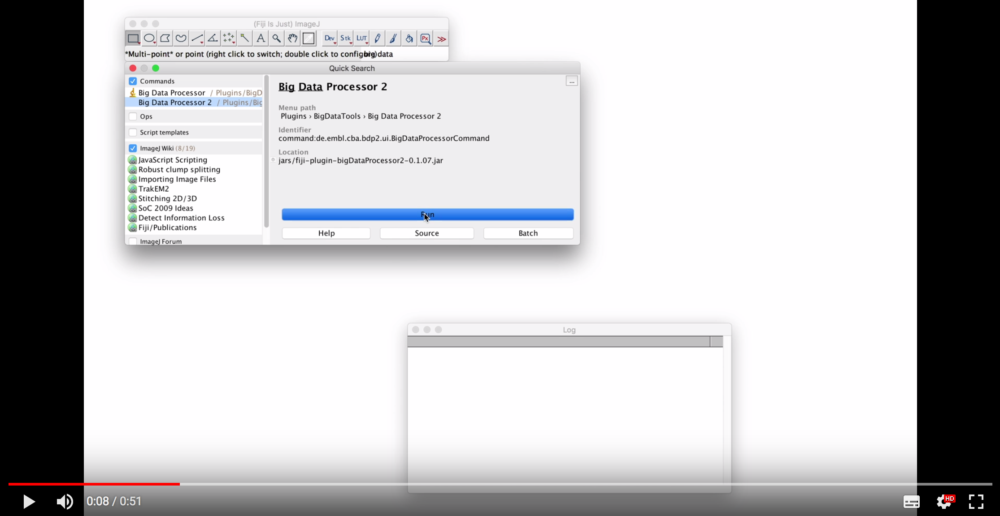
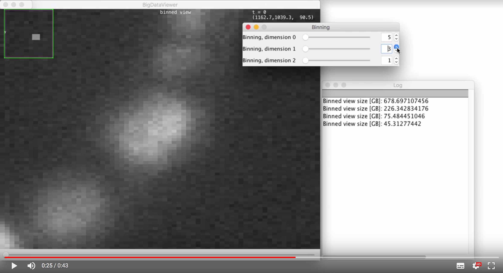
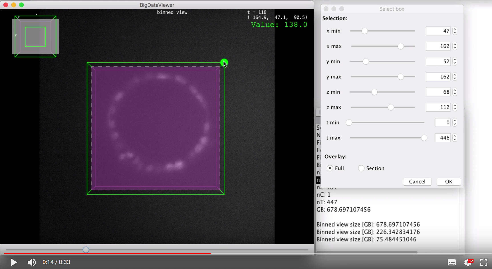
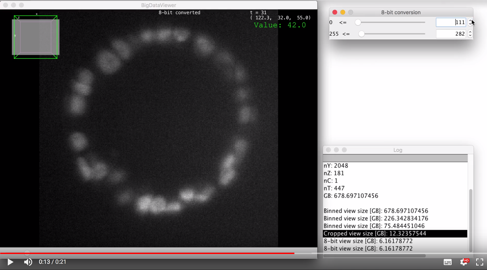

# BigDataProcessor2

Interactive processing of TB-sized image data within [Fiji](http://fiji.sc/), on your laptop.

## Installation

BigDataProcessor2 is a Fiji Plugin.

- Please install [Fiji](fiji.sc)
- Within Fiji, please enable the following [Update Site](https://imagej.net/Update_Sites): 
    - [X] EMBL-CBA
- Restart Fiji
- BigDataProcessor2 can be found in the Plugins menu (as it is an ImageJ2 plugin you have to scroll all the way to the bottom).

## Overview and examples

### Opening TB-sized Tiff or Hdf5 based raw data

Below movie demonstrates opening of 670 GB Hdf5 image data, acquired by light-sheet microscopy. 
The data format is one volumetric Hdf5 file per time-point. As the data is needed to be streamed from the camera onto a disk efficiently, the Hdf5 files are neither specifically chunked for efficient 3D access nor do they contain a multi-resolution pyramid. 
Also, there is no special header file linking the different time-points. Nevertheless, as the movie shows  *(click below to play)*, 
the data can be opened and browsed within seconds. 

### Interactive binning

For camera based microscopy systems the pixel size cannot be freely chosen during acquisition. 
Thus, the user is often forced to over-sample in order not to lose important information. 
However, this leads to large data volumes with noise since the information is spread across many pixels and therefore resulting in 
(vastly) increased image processing times.  
The BigDataProcessor2 makes it possible to explore different binnings interactively, thereby providing an efficient means to 
attain a binning at which the corresponding scientific question can be efficiently addressed.*(click below to play the movie)*

### Interactive 3D+t Cropping

Often, large volumes are acquired than required, e.g. to accommodate sample drift, motion, or growth. 
Below movie shows *(click below to play)* how the BigDataProcessor2 can be interactively used to crop the data to only contain the relevant parts.

### Interactive conversion to 8-bit

Cameras typically produce image data at 12, 14, or 16 bit-depths (12 and 14 bit are not common data formats they are often stored as 16 bit anyway). 
For many image analysis tasks, 8-bit depth is usually sufficient affording the user to reduce data size as well as increase processing time by a factor of 2.
However, converting 16-bit to 8-bit data can be tricky as it entails deciding on a specific mapping from the higher to the lower bit-depth. 
Choosing a mapping of 65535 => 255 and 0 => 0 can lead to a low dynamic range in the 8-bit range especially when the input contains 
only a subset of the full 16-bit range. Furthermore, choosing `max` => 255 and `min` => 0, can be sub-optimal if 
there are spurious pixels with very high values, making the `max` value very high, again leading to a low dynamic range for the relevant grey values 
in the 8-bit converted data.  
The below movie *(click below to play)* demonstrates interactive 8-bit conversion, where the user can interactively explore different mappings while browsing the entire data. 
This is done lazily, i.e. the data on disk is not altered at this stage.

## Detailed information

**BigDataProcessor2 (BDP2)**  is an [ImageJ](https://imagej.net) plugin designed for inspection, manipulation and conversion of big data image formats even on a basic laptop or a computer.

BigDataProcessor2 is based on [BigDataViewer](https://imagej.net/BigDataViewer) for rendering and the [ImgLib2](https://imagej.net/ImgLib2) library for image processing. 

BigDataProcessor2 implements a [Lazy Loading design pattern](https://en.wikipedia.org/wiki/Lazy_loading) to render Terabyte sized big data image data produced by light-sheet and electron microscopy, also on laptops with limited RAM. 

The plugin facilitates loading & saving of TIFF, HDF5 and Imaris file formats meanwhile allowing the user to shear, crop or bin. *(check out the User Documentation section below to explore what more you can do!)*

The plugin also encloses **BigDataTracker**, an object tracker tool for the big data images and also allowing to view and save just the tracked regions.

## History
The BigDataProcessor2 is a new version of the **BigDataTools** plugin, a.k.a [BigDataProcessor](https://github.com/embl-cba/fiji-plugin-bigDataProcessor). BigDataProcessor2 is developed almost from scratch using the ImgLib2 framework.

## Supported Formats

- Multi-stack TIFF
- Single plane TIFF
- Multi-stack HDF
- Multi-stack IMARIS HDF

## Contributors

Ashis Ravindran&nbsp;&nbsp;&nbsp;&nbsp;&nbsp;&nbsp;&nbsp;&nbsp;&nbsp;&nbsp;&nbsp;
&nbsp;&nbsp;Christian Tischer  
ashis.r91@gmail.com&nbsp;&nbsp;&nbsp;&nbsp;&nbsp;&nbsp;christian.tischer@embl.de

## User Documentation

### Image viewing

Images are displayed in a slicing mode. The initial view is a slice perpendicular to the z axis (i.e. an xy plane). The currently viewed plane can be changed by the following keyboard shortcuts:
- **[ Shift X ]** Shows a yz plane
- **[ Shift Y ]** Shows a xz plane
- **[ Shift Z ]** Shows a xy plane
- **[ , ]** or **[ . ]** Change plane slowly
- **[ Shift , ]** or **[ Shift . ]** Change plane fast
- You can also drag the mouse while keeping the left mouse button pressed to inspect the data at oblique views.

#### Tip 

- Due the way most data are layout on disc, it is faster to inspect the data only using the **[ Shift Y ]** and **[ Shift Z ]** views, as the **[ Shift X ]** view will render much slower.

### Processing operations 

