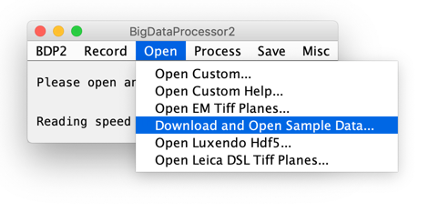
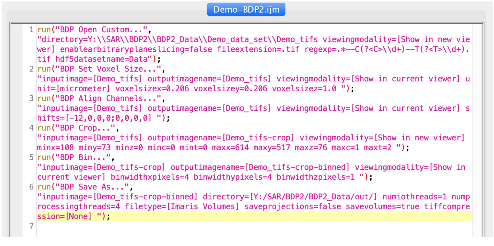
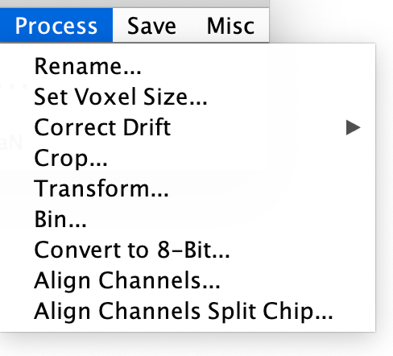

BigDataProcessor2 (BDP2) is a [Fiji](http://fiji.sc/) plugin for interactive processing of TB-sized image data. BDP2 uses [BigDataViewer](https://imagej.net/BigDataViewer) for rendering and the [ImgLib2](https://imagej.net/ImgLib2) library for image processing. 

The BDP2 is the new version of [BigDataProcessor1](https://github.com/bigdataprocessor/bigdataprocessor1). 

Main features:
- [lazy-loading](https://en.wikipedia.org/wiki/Lazy_loading) of TB sized image data
- [lazy-computation](https://en.wikipedia.org/wiki/Lazy_evaluation) of TB sized image data
- [ImageJ macro](https://imagej.nih.gov/ij/developer/macro/macros.html) recording for automation

**Schematic representation of a lazy-processing workflow in BDP2:** Dashed arrows represent lazy-computation, where only the currently viewed image plane is processed. A complete data browsing, data selection and data processing workflow can be configured in a few minutes even for TB-sized image data. Only the final saving to disk requires processing of the whole data set and will take a correspondingly long time (up to hours).

**[Movie real-time recording](https://www.youtube.com/embed/OixZ0ILbkvc "BigDataProcessor2 Workflow") of a typical BDP2 workflow:** The movie shows a screen recording of a basic processing workflow of an 250 GB HDF5 based image data set acquired by light-sheet microscopy. The following steps are demonstrated: `Open Luxendo HDF5 -> Brightness & Color adjustment -> Set Voxel Size -> Align Channels -> Crop -> Bin -> Save`. The 2 color early mouse embryo data were provided by Manuel Eguren, Ellenberg group EMBL Heidelberg.

## Contribute

[How to contribute.](https://github.com/bigdataprocessor/bigdataprocessor2/blob/master/CONTRIBUTE.md)

## Cite

Please cite our bioRxiv preprint: https://www.biorxiv.org/content/10.1101/2020.09.23.244095v1

## Install

BigDataProcessor2 is a Fiji plugin and can be installed via an update site.

- Please download a new [Fiji](fiji.sc)
- Within Fiji, please enable the following [Update Site](https://imagej.net/Update_Sites): 
    - [X] BigDataProcessor
    - Note: The (deprecated) EMBL-CBA update site must **not** be checked because of compatibility issues!
- Restart Fiji

## Start

In the Fiji Plugins menu scroll far down and start BigDataProcessor2:

This opens up an empty BigDataViewer window with additional menu entries.

Note: **Don't use the Commands**, they just serve the macro recording.

## Quick start

The easiest way to explore BDP2's functionality is to download and open a small example data set and explore the processing options.

# User Guide 

## Main user interface

BDP2 comes with its own a user interface (UI) where all functionality can be accessed (the menus in the ImageJ UI will typically not work here). 
The UI shows information about the currently active image as well as the current and average image data reading speed.
It is possible to have multiple images (BigDataViewer windows) open at the same time. Following the usual ImageJ convention, the "active" image is the one that you clicked on last.

## Record macro

Macro recording is one of ImageJ’s greatest features as it allows users without programming experience to record reusable scripts. Can be used for automation but also for documentation. 
All actions can be recorded as ImageJ macros. To enable this please:

Note: This is equivalent to [ Plugins > Macros > Record... ] in the ImageJ menu, we just thought it is more convenient to also have it in the BigDataProcessor2 menu tree.

Example of recorded macro. 

Enable/ disable macro recording. The user can choose to turn macro recording on and off and also select from three recording languages, namely the IJ1 Macro language, Jython (Juneau et al. 2010) and JavaScript (https://en.wikipedia.org/wiki/JavaScript).
Motivation: Macro recording is one of ImageJ’s greatest features as it allows users without programming experience to record reusable scripts. It can be used for automation but also for sharing, documentation and publishing.  In our experience, next to the IJ1 Macro language, Jython is the second most popular scripting language for ImageJ, most likely due to the overall popularity of python (https://insights.stackoverflow.com/survey/2019#most-popular-technologies). We also support JavaScript due to its increasing popularity and importance in web based applications. ImageJ supports many more scripting languages, however, we decided to limit our support to a few in order to guide the user in their choice.

Example Recorded IJ1 Macro Script

run("BDP2 Open Luxendo Channels...", "viewingmodality=[Show in new viewer] directory=[/Users/tischer/Desktop/bpd2-benchmark/h5/in] enablearbitraryplaneslicing=false stackindex=6 channels=[channel_2_Cam_Long] ");
run("BDP2 Crop...", "inputimage=[in] outputimagename=[in-crop] viewingmodality=[Show in new viewer] minx=307 miny=576 minz=44 minc=0 mint=0 maxx=1730 maxy=1644 maxz=54 maxc=0 maxt=9 ");
run("BDP2 Bin...", "inputimage=[in-crop] outputimagename=[in-crop-binned] viewingmodality=[Show in current viewer] binwidthxpixels=3 binwidthypixels=3 binwidthzpixels=1 ");
run("BDP2 Save As...", "inputimage=[in-crop-binned] directory=[/Users/tischer/Desktop/bpd2-benchmark/h5/out/] numiothreads=1 numprocessingthreads=4 filetype=[TIFFVolumes] saveprojections=true savevolumes=true tiffcompression=[None] tstart=0 tend=9 ");

Example Recorded Jython Script

# To run this script, please select language: Python
from de.embl.cba.bdp2 import BigDataProcessor2;
import java;
from jarray import array;
from de.embl.cba.bdp2.save import SavingSettings;
from de.embl.cba.bdp2.save import SaveFileType;

# Open Luxendo HDF5 File Series...
image = BigDataProcessor2.openHDF5Series( "/Users/tischer/Desktop/bpd2-benchmark/h5/in", ".*stack_6_(?<C1>channel_.*)/(?<C2>Cam_.*)_(?<T>\d+).h5", "Data", ["channel_2_Cam_Long"] );

# BigDataProcessor2.showImage( image, True );

# Crop...
image = BigDataProcessor2.crop( image, [307,576,44,0,0,1730,1644,54,0,9] );
image.setName( "in-crop" );

# Bin...
image = BigDataProcessor2.bin( image, [3,3,1,1,1] );
image.setName( "in-crop-binned" );

# Save image
savingSettings = SavingSettings.getDefaults();
savingSettings.volumesFilePathStump = "/Users/tischer/Desktop/bpd2-benchmark/h5/out/volumes/in-crop-binned";
savingSettings.projectionsFilePathStump = "/Users/tischer/Desktop/bpd2-benchmark/h5/out/projections/in-crop-binned";
savingSettings.numIOThreads = 1;
savingSettings.numProcessingThreads = 4;
savingSettings.fileType = SaveFileType.TIFFVolumes;
savingSettings.saveProjections = True;
savingSettings.saveVolumes = True;
savingSettings.compression = "None";
savingSettings.tStart = 0;
savingSettings.tEnd = 9;
BigDataProcessor2.saveImageAndWaitUntilDone( image, savingSettings );

Example Recorded JavaScript Script

// To run this script, please select language: JavaScript
importClass(Packages.de.embl.cba.bdp2.BigDataProcessor2);
importClass(Packages.de.embl.cba.bdp2.save.SavingSettings);
importClass(Packages.de.embl.cba.bdp2.save.SaveFileType);

// Open Position And Channel Subset...
image = BigDataProcessor2.openHDF5Series( "/Volumes/Tischi/big-image-data/luxendo-publication-figure/mouse_2_Cam", ".*stack_6_(?<C1>channel_.*)/(?<C2>Cam_.*)_(?<T>\\d+).h5", "Data", ["channel_2_Cam_Long","channel_2_Cam_Short"] );
// BigDataProcessor2.showImage( image, true );

// Crop...
image = BigDataProcessor2.crop( image, [502,454,14,0,0,1802,1685,87,1,143] );
image.setName( "mouse_2_Cam-crop" );

// Bin...
image = BigDataProcessor2.bin( image, [3,3,1,1,1] );
image.setName( "mouse_2_Cam-crop-binned" );

// Save...
savingSettings = SavingSettings.getDefaults();
savingSettings.volumesFilePathStump = "/Volumes/Tischi/tmp/volumes/mouse_2_Cam-crop-binned";
savingSettings.projectionsFilePathStump = "/Volumes/Tischi/tmp/projections/mouse_2_Cam-crop-binned";
savingSettings.numIOThreads = 1;
savingSettings.numProcessingThreads = 4;
savingSettings.fileType = SaveFileType.TIFFVolumes;
savingSettings.saveProjections = true;
savingSettings.saveVolumes = true;
savingSettings.compression = "None";
savingSettings.tStart = 0;
savingSettings.tEnd = 1;
BigDataProcessor2.saveImageAndWaitUntilDone( image, savingSettings );

## Open dataset

In the BigDataViewer window, go to the menu bar and use the menu items in [ BigDataProcessor2 > Open ].

Screenshot of the Open menu

**Open > Open Custom…**
Open datasets consisting of a collection of TIFF or HDF5 volumes. The assignment of each file (volume) to a channel and time point can be specified by a regular expression.  

**Open > Open Custom Help...**
Shows and explains a number of regular expressions that can be used in the [ Open > Open Custom… ] menu item. 

***Open > Open EM TIFF Planes...***
Opens a single folder with TIFF single plane files. Each file will be assigned to one z-plane in a dataset with one color and one time point. 
Motivation: This is a typical format for volume EM data to be stored in.

***Open > Download and Open Sample Data...***
Download and open sample data stored in the BioStudies archive (https://www.ebi.ac.uk/biostudies/studies/S-BSST417?query=bigdataprocessor2). Motivation: Conveniently accessible example data is useful to explore/ teach BigDataProcessor2 without the need to prepare suited input data. 

***Open > Open Luxendo HDF5...***
Open datasets acquired with Luxendo light sheet microscopes. 
Motivation: Luxendo uses an open-source hdf5 based file format. We added convenience functionality for opening those files without the need to enter a complex regular expression. 

***Open > Open Leica DSL TIFF Planes...***
Open datasets acquired with Leica DSL microscopes, choosing “Auto-Save, Data type: Tif, Compression: Uncompressed” as an option (Leica’s proprietary file format is called .lif, which we do not currently support).
Motivation: While the TIFF file format is open source, Leica’s naming scheme would require entering a complex regular expression and we thus implemented this convenience opening functionality. 

## Process

***Process > Rename…***
Rename the data set.

***Process > Set Voxel Size…***
Change the voxel size image properties. 
Motivation: The voxel size may not always be read correctly from the data set, thus it is useful to have the option to set it manually. 

***Process > Correct Drift***
Correct sample motion by interactively creating a 3D track, which will be applied such that the image is stationary relative to the track positions.
Motivation: For time lapse data there is a risk that a sample moves during acquisition. To accommodate for either sample or microscope drift it is common to choose a field of view to encompass expected drift at the expense of larger data footprint. This can be compensated by cropping the data. However, applying a static volumetric crop over the whole time lapse is suboptimal. Therefore an ideal crop would be on drift corrected data (see Supplementary Movie 2). Additional applications can be, e.g., tracking motile cells in tissues.

***Process > Correct Drift > Create Track…***
Create a 3D track by manually placing anchor points in a subset of time points (track positions in the other time-points will be automatically added by linear interpolation). When done, save the track as a Json file to disk, to be used in [ Process > Correct Drift > Apply Track…].

***Process > Correct Drift > Apply Track…***
Load a 3D track from a file (created with [ Process > Correct Drift > Create Track…]) and apply it to the data set. This will cause the dataset to be displayed with each timepoint shifted according to the track positions (no data duplication). 

***Process > Crop…***
Interactively specify a 4D (x,y,z,t) subset of the data to be displayed in a new viewer window.
Motivation: Imaging processes in living samples require setting up imaging parameters before knowing exactly when and where the process of interest takes place. Therefore the imaging field of view (x,y,z) and temporal extent (t) are usually set generously to accommodate sample drift, motion, or growth. Using the crop function one can reduce the dataset to the necessary spatial and temporal dimensions.
see also the [video_example_cropping](#croppinglink) demonstrating how the BigDataProcessor2 can be interactively used to crop the data to only contain the relevant parts.

***Process > Bin…***
Performs arbitrary binning along x y and z coordinates.
Motivation: For camera-based microscopy systems the effective pixel size often cannot be freely chosen during acquisition. Thus, the user may be forced to over-sample, leading to large data volumes with noise since the information is spread across many pixels and therefore resulting in (vastly) increased image processing times. Thus, binning the data post-acquisition is can be very useful as it both reduces data size and noise, often without compromising scientific accuracy.
Motivation: For camera-based microscopy systems the effective pixel size often cannot be freely chosen during acquisition. Thus, the user may be forced to over-sample, leading to large data volumes and potentially with noise since the information is spread across many pixels and therefore resulting in (vastly) increased image processing times. Thus, binning the data post-acquisition can be very useful as it both reduces data size (and noise), often without compromising scientific accuracy.
The BigDataProcessor2 makes it possible to develop different binnings interactively, thereby providing an efficient means to 
attain a binning at which the corresponding scientific question can be efficiently addressed. See also [video_example_binning](#binninglink)    

***Process > Convert to 8-bit…***
Convert the data set from 16 to 8-bit depth. 
Motivation: Cameras typically produce image data at 12, 14, or 16 bit-depths. For many image analysis tasks, 8-bit depth is sufficient affording the user to reduce data size by a factor of 2. However, converting 16-bit to 8-bit data is not trivial as it entails deciding on a specific mapping from the higher to the lower bit-depth, which will lose information. Choosing a mapping of 65535 to 255 and 0 to 0 can lead to a low dynamic range in the 8-bit range especially when the input contains only a subset of the full 16-bit range. Also mapping max(image) to 255 and min(image) to 0 can be sub-optimal if there are spurious pixels with very high values, again leading to a low dynamic range for the relevant grey values in the 8-bit converted data. We thus provide the possibility to freely specify a mapping while browsing the data set to inspect at each position current result of the conversion. See also [video_example_convert_to_8-bit](#bitdepthlink)

***Process > Align Channels…***
Shift one channel in relation to the other to compensate pixel offsets e.g. due to chromatic shifts. 
Motivation: Chromatic shifts either due to optics being corrected only for a given wavelength range, or parallel acquisition of two channels on two cameras can lead to offsets between the two channels/ images. We, therefore, provide the functionality to correct for such channel shifts in x,y and z. 

***Process > Align Channels Split Chip…***
Specify two crop regions in one channel and convert those regions into two channels, i.e. the number of channels of the resulting image is increased by one.
Motivation: For the sake of acquisition speed, some fluorescence microscope systems acquire the signal of several fluorescence channels simultaneously on the same camera chip. Thus, we provide the functionality to convert such data into a conventional multi-channel data set by aligning the channels from a “split chip”. 

***Process > Transform...***
Renders an affine view of the data. 
Motivation: Useful when data is warped due to an acquisition process that renders x-y-z non-orthogonal. Examples are when a stage movement is not orthogonal to the field of view. Also useful in single objective light sheet microscopy.  
 

## Save

 

***Save > Save as Imaris Volumes…***
Save data set as an hdf5 based pyramidal Imaris file (http://open.bitplane.com/ims), with each channel and time point saved as an individual .h5 file and one .ims header file that can be used to view the data both in Fiji’s BigDataViewer and in the commercial Imaris software.
Motivation: The low data overhead of a pyramidal scheme (in 3D for binning 2 x 2 x 2 at each pyramidal level  ~14%) is a marginal cost for a substantially improved user experience when viewing the data. We, therefore, provide saving data in an open file format that offers this functionality based on hdf5, which means that it can be handled with all common programming languages.

***Save > Save as TIFF Volumes...***
Save the dataset as a series of TIFF stacks with each channel and time point saved as an individual .tif file.
Motivation: TIFF stacks are still the most used and compatible file format that can be easily opened by all software for downstream analysis. 

***Save > Save as TIFF Planes...***
Save the dataset as a series of TIFF planes, where each z-slice, channel and time point are saved as an individual .tif file.
Motivation: Saving a volume as a series of TIFF planes is popular e.g. in the EM community.

## Misc

***Misc > Show in Hyperstack Viewer***
Opens the current image virtually in the “classic” ImageJ hyperstack viewer.
Motivation: As BigDataViewer is a relatively recent addition to the ImageJ ecosystem  most users are still more comfortable with the ImageJ hyperstack viewer. In addition, with the data being displayed in the hyperstack viewer, one has access to many useful inspection tools such as intensity histograms and intensity line profiles.

# Additional information

### More example videos

#### Binning
    

#### Cropping

#### Bit-depth conversion

