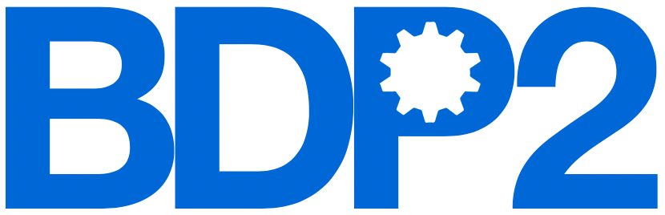
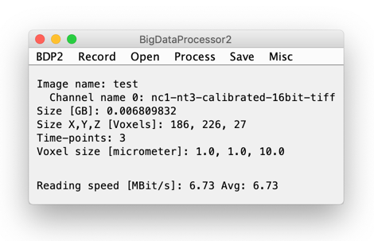
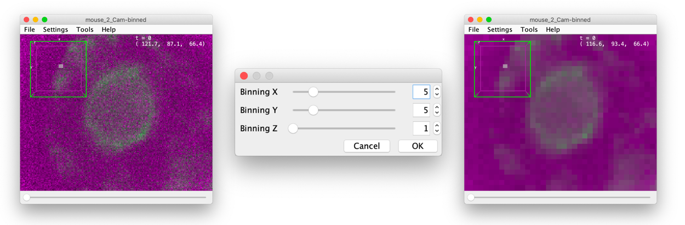
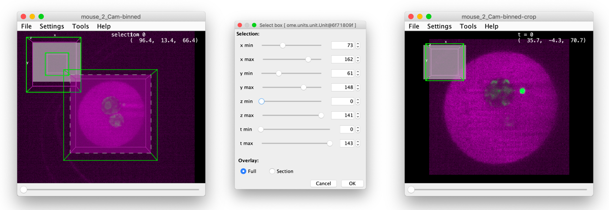
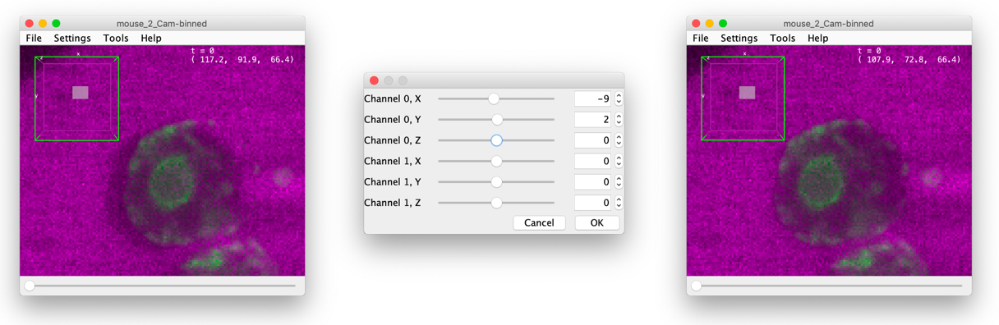
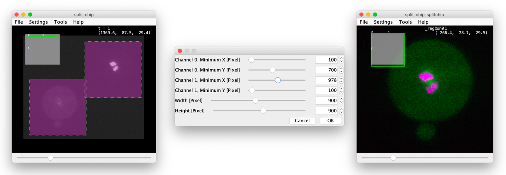
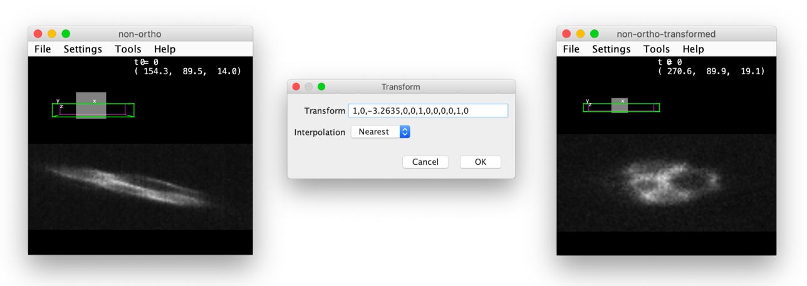
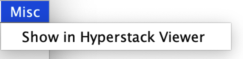

BigDataProcessor2 (BDP2) is a [Fiji](http://fiji.sc/) plugin for interactive processing of TB-sized image data.

BDP2 uses [BigDataViewer](https://imagej.net/BigDataViewer) for rendering and the [ImgLib2](https://imagej.net/ImgLib2) library for image processing. 

The BDP2 is the new version of [BigDataProcessor1](https://github.com/bigdataprocessor/bigdataprocessor1). 

Main features:
- [lazy-loading](https://en.wikipedia.org/wiki/Lazy_loading) of TB sized image data
- [lazy-processing](https://en.wikipedia.org/wiki/Lazy_evaluation) of TB sized image data
- [ImageJ macro](https://imagej.nih.gov/ij/developer/macro/macros.html) scripting support

**Schematic representation of a lazy-processing workflow in BDP2:** Dashed arrows represent lazy-computation, where only the currently viewed image plane is processed. A complete data browsing, data selection and data processing workflow can be configured in a few minutes even for TB-sized image data. Only the final saving to disk requires processing of the whole data set and will take a correspondingly long time (up to hours).

**[Movie real-time recording](https://www.youtube.com/embed/OixZ0ILbkvc "BigDataProcessor2 Workflow") of a typical BDP2 workflow:** The movie shows a screen recording of a basic processing workflow of an 250 GB HDF5 based image data set acquired by light-sheet microscopy. The following steps are demonstrated: `Open Luxendo HDF5 -> Brightness & Color adjustment -> Set Voxel Size -> Align Channels -> Crop -> Bin -> Save`. The 2 color early mouse embryo data were provided by Manuel Eguren, Ellenberg group EMBL Heidelberg.

## Contribute

[How to contribute.](https://github.com/bigdataprocessor/bigdataprocessor2/blob/master/CONTRIBUTE.md)

## Cite

Please cite our bioRxiv preprint: https://www.biorxiv.org/content/10.1101/2020.09.23.244095v1

## Install

BigDataProcessor2 is a Fiji plugin and can be installed via an update site.

- Please download a new [Fiji](fiji.sc)
- Within Fiji, please enable the following [Update Site](https://imagej.net/Update_Sites): 
    - [X] BigDataProcessor
    - Note: The (deprecated) EMBL-CBA update site must **not** be checked because of compatibility issues!
- Restart Fiji

## Start

[ Fiji > Plugins > BigDataProcessor > BigDataProcessor2 ]

## Quick start

The easiest way to explore BDP2's functionality is to download and open a small example data set and explore the processing options.

[ BigDataProcessor2 > Open > Download and Open Sample Data ]

# User Guide 

## Main user interface

BDP2 comes with its own a user interface (UI) where all functionality can be accessed (the menus in the ImageJ UI will typically not work here). 
The UI shows information about the currently active image as well as the current and average image data reading speed.
It is possible to have multiple images (BigDataViewer windows) open at the same time. Following the usual ImageJ convention, the "active" image is the one that you clicked on last.

## Record macro

Macro recording is one of ImageJ’s greatest features as it allows users without programming experience to record reusable scripts. Can be used for automation but also for documentation. All actions can be recorded as ImageJ macros...

### Record Menu

**Record > Record...**
Enable/ disable macro recording. The user can choose to turn macro recording on and off and also select from three recording languages, namely the IJ1 Macro language, Jython (Juneau et al. 2010) and JavaScript (https://en.wikipedia.org/wiki/JavaScript).
Motivation: Macro recording is one of ImageJ’s greatest features as it allows users without programming experience to record reusable scripts. It can be used for automation but also for sharing, documentation and publishing.  In our experience, next to the IJ1 Macro language, Jython is the second most popular scripting language for ImageJ, most likely due to the overall popularity of python (https://insights.stackoverflow.com/survey/2019#most-popular-technologies). We also support JavaScript due to its increasing popularity and importance in web based applications. ImageJ supports many more scripting languages, however, we decided to limit our support to a few in order to guide the user in their choice.

## Open

We currently support opening of
1. TIFF or HDF5 based images files series
2. Everything that can be opened with Bio-Formats

### Open Menu
**Open > Help**
Provides detailed information about below menu items for loading big image data. In particular, it provides a list of regular expressions that can be used to open custom image file series.

**Open > Open Bio-Formats…**
Uses the Bio-Formats library (Linkert et al. 2010) to read from 140+ image file formats. It tries to do so lazily and can thus also work for TB sized data, but performance may depend on the image data type. If you want to read from multi file series TIFF or HDF5 data with high performance we recommend using [ Open Custom File Series… ] (see below).

**Open > Open Custom File Series…**
Open datasets consisting of a collection of TIFF or HDF5 volumes. The assignment of each file (volume) to a channel and time point can be specified by a regular expression. Please see [ Open > Help ] for more detailed information. Motivation: TIFF and HDF5 are common file formats for big image data. For example, Viventis Microscopy (https://www.viventis-microscopy.com) and Luxendo (https://luxendo.eu) save their light sheet data in multi file TIFF and HDF5 series, respectively. With this menu item we support efficient lazy loading from data saved in such file formats. As determining the correct regular expression can be somewhat cumbersome, we provide convenience menu items for prevalent cases (see below [ Open > Open Predefined File Series ]).

**Open > Open Predefined File Series > Open EM TIFF Plane File Series...**
Opens a single folder with TIFF single plane files. Each file will be assigned to one z-plane in a dataset with one color and one time point. Motivation: This is a typical format for volume EM data to be stored in and we wanted to relieve users from the burden to type in the regular expression for this.

**Open > Open Predefined File Series > Open Leica DSL TIFF File Series...**
Opens datasets acquired with Leica DSL microscopes, choosing “Auto-Save, Data type: Tif, Compression: Uncompressed” as an option within the Leica acquisition software. Motivation: Leica’s naming scheme would require entering a complex regular expression and we thus implemented this convenience opening functionality. 

**Open > Open Predefined File Series > Open Luxendo HDF5 File Series...**
Open datasets acquired with Luxendo (https://luxendo.eu) light sheet microscopes. Motivation: Luxendo uses an HDF5 based file format. We added convenience functionality for opening those files without the need to enter complex regular expressions. 

**Open > Open Predefined File Series > Open Viventis TIFF File Series...**
Open datasets acquired with Viventis Microscopy (https://www.viventis-microscopy.com) light sheet microscopes. Motivation: Viventis uses a TIFF based file format. We added convenience functionality for opening those files without the need to enter regular expressions. 

**Open > Download and Open Sample Data...**
Download and open sample data stored in the BioStudies archive (Sarkans et al. 2017). 
Access data directly in the archive via this link: https://www.ebi.ac.uk/biostudies/studies/S-BSST417?query=bigdataprocessor2
Motivation: Conveniently accessible example data is useful to explore and teach BigDataProcessor2 functionality without the need to prepare suitable input data. 

## Process
### Process Menu

**Process > Rename…**
Rename the data set and channels.

**Process > Set Voxel Size…**
Changes the voxel size. Motivation: The voxel size may not always be read correctly from the data set, thus it is useful to have the option to set it manually. 

**Process > Correct Drift**
Correct sample motion by interactively creating a 3D track, which will be applied such that the image is stationary relative to the track positions.
Motivation: For time lapse data there is a risk that a sample moves during acquisition. To accommodate for either sample or microscope drift it is common to choose a field of view to encompass expected drift at the expense of larger data footprint. This can be compensated by cropping the data. However, applying a static volumetric crop over the whole time lapse is suboptimal. Therefore an ideal crop would be on drift corrected data (see Supplementary Movie 2). Additional applications can be, e.g., tracking motile cells in tissues. 

**Process > Correct Drift > Create Track…**
Create a 3D track by manually placing anchor points in a subset of time points (track positions in the other time-points will be automatically added by linear interpolation). When done, save the track as a Json file to disk, to be used in [ Process > Correct Drift > Apply Track…].
    

***Process > Bin…***

Performs arbitrary binning along x y and z coordinates.
Motivation: For camera-based microscopy systems the effective pixel size often cannot be freely chosen during acquisition. Thus, the user may be forced to over-sample, leading to large data volumes with noise since the information is spread across many pixels and therefore resulting in (vastly) increased image processing times. Thus, binning the data post-acquisition is can be very useful as it both reduces data size and noise, often without compromising scientific accuracy.
Motivation: For camera-based microscopy systems the effective pixel size often cannot be freely chosen during acquisition. Thus, the user may be forced to over-sample, leading to large data volumes and potentially with noise since the information is spread across many pixels and therefore resulting in (vastly) increased image processing times. Thus, binning the data post-acquisition can be very useful as it both reduces data size (and noise), often without compromising scientific accuracy.
The BigDataProcessor2 makes it possible to develop different binnings interactively, thereby providing an efficient means to 
attain a binning at which the corresponding scientific question can be efficiently addressed. See also [video_example_binning](#binninglink)  

***Process > Crop…***

Interactively specify a 4D (x,y,z,t) subset of the data to be displayed in a new viewer window.
Motivation: Imaging processes in living samples require setting up imaging parameters before knowing exactly when and where the process of interest takes place. Therefore the imaging field of view (x,y,z) and temporal extent (t) are usually set generously to accommodate sample drift, motion, or growth. Using the crop function one can reduce the dataset to the necessary spatial and temporal dimensions.
see also the [video_example_cropping](#croppinglink) demonstrating how the BigDataProcessor2 can be interactively used to crop the data to only contain the relevant parts.

***Process > Convert to 8-bit…***
Convert the data set from 16 to 8-bit depth. 
Motivation: Cameras typically produce image data at 12, 14, or 16 bit-depths. For many image analysis tasks, 8-bit depth is sufficient affording the user to reduce data size by a factor of 2. However, converting 16-bit to 8-bit data is not trivial as it entails deciding on a specific mapping from the higher to the lower bit-depth, which will lose information. Choosing a mapping of 65535 to 255 and 0 to 0 can lead to a low dynamic range in the 8-bit range especially when the input contains only a subset of the full 16-bit range. Also mapping max(image) to 255 and min(image) to 0 can be sub-optimal if there are spurious pixels with very high values, again leading to a low dynamic range for the relevant grey values in the 8-bit converted data. We thus provide the possibility to freely specify a mapping while browsing the data set to inspect at each position current result of the conversion. See also [video_example_convert_to_8-bit](#bitdepthlink)

***Process > Align Channels…***

Shift one channel in relation to the other to compensate pixel offsets e.g. due to chromatic shifts. 
Motivation: Chromatic shifts either due to optics being corrected only for a given wavelength range, or parallel acquisition of two channels on two cameras can lead to offsets between the two channels/ images. We, therefore, provide the functionality to correct for such channel shifts in x,y and z. 

***Process > Align Channels Split Chip…***

Specify two crop regions in one channel and convert those regions into two channels, i.e. the number of channels of the resulting image is increased by one.
Motivation: For the sake of acquisition speed, some fluorescence microscope systems acquire the signal of several fluorescence channels simultaneously on the same camera chip. Thus, we provide the functionality to convert such data into a conventional multi-channel data set by aligning the channels from a “split chip”. 

***Process > Transform...***

Renders an affine view of the data. 
Motivation: Useful when data is warped due to an acquisition process that renders x-y-z non-orthogonal. Examples are when a stage movement is not orthogonal to the field of view. Also useful in single objective light sheet microscopy.  
 

## Save

We currently support saving to
1. TIFF stack or plane files series
2. HDF5 chunked multi-resolution file series 

### Save Menu 

***Save > Save as Imaris Volumes…***
Save data set as an hdf5 based pyramidal Imaris file (http://open.bitplane.com/ims), with each channel and time point saved as an individual .h5 file and one .ims header file that can be used to view the data both in Fiji’s BigDataViewer and in the commercial Imaris software.
Motivation: The low data overhead of a pyramidal scheme (in 3D for binning 2 x 2 x 2 at each pyramidal level  ~14%) is a marginal cost for a substantially improved user experience when viewing the data. We, therefore, provide saving data in an open file format that offers this functionality based on hdf5, which means that it can be handled with all common programming languages.

***Save > Save as TIFF Volumes...***
Save the dataset as a series of TIFF stacks with each channel and time point saved as an individual .tif file.
Motivation: TIFF stacks are still the most used and compatible file format that can be easily opened by all software for downstream analysis. 

***Save > Save as TIFF Planes...***
Save the dataset as a series of TIFF planes, where each z-slice, channel and time point are saved as an individual .tif file.
Motivation: Saving a volume as a series of TIFF planes is popular e.g. in the EM community.

## Misc

### Misc Menu

**Misc > Configure Lazy Loading...**
Configure the x, y, and z dimensions of the lazy loading chunks. Motivation: BDP2 lazy loads small chunks from the big image data set, enabling interactive processing of TB sized image data on a standard computer with only a few GB of random access memory. Here, the size of these chunks can be configured. Normally the default values are good and we do not recommend changing them. This menu item has mainly been implemented to facilitate teaching about how different lazy loading schemes affect the performance for different file formats. If the data is loaded via Bio-Formats this setting is currently ignored.

**Misc > Show in Hyperstack Viewer**
Opens the current image virtually in the “classic” ImageJ hyperstack viewer. Motivation: BigDataViewer is a relatively recent addition to the ImageJ ecosystem  and many users are more comfortable using the ImageJ hyperstack viewer. In addition, with the data being displayed in the hyperstack viewer, one has access to many useful ImageJ inspection tools such as intensity histograms and intensity line profiles.

**Misc > Configure Logging...**
Presents different logging levels, currently: Normal, Debug, and Benchmark. Motivation: For debugging and benchmarking it is very useful to see additional information, which would however distract in daily routine use. Please be careful using the Benchmark mode, because additional code is executed that may slow down the application.

# Additional information

### More example videos

#### Binning
    

#### Cropping

#### Bit-depth conversion

## Hardware recommendations ##
It is recommended that the image data is accessed via a local area network (LAN) cable. For example, accessing the data over a slow (few MB/s) internet connection (e.g., in a home office scenario) can result in update rates of the currently viewed image plane of less than once per second, which is not ideal for interactive browsing of the data. For a good user experience tens of MB/s data transfer rate or above is recommended for typical data sets with image planes that are about 2k x 2k pixels in size.
RAM is in general not limiting even for processing of the full data set, because the application tries to only keep the volumes (channels) for one time point in RAM, which typically does not exceed the RAM of a modern laptop (e.g., 16 GB). However, BDP2 offers the option to employ multiple I/O threads (if either the input or output format is HDF5 based). We currently do not recommend using multiple I/O threads as the HDF5 library that we currently use is not capable of multithreading. If multiple I/O threads are chosen, BDP2 processes multiple time points in parallel and the RAM requirements increase linearly as the corresponding data needs to be kept in RAM simultaneously. In practice, finding the optimal number of I/O threads to speed up the processing is hardware and data set dependent and should be tested for each setup. 
Regarding the CPU, the processing time will be faster with increasing CPU cores as the processing (e.g. binning) is multi-threaded. In practice, adding more cores may at some point be of limited use, as the overall processing time may become limited by I/O operations.
Overall, in our experience, the ideal scenario is to use the BDP2 UI to record the processing as a script (currently IJ Macro or Jython) and then execute this script on a computer cluster, parallelising over the time-points to be processed. In order to enable this, we have added a [ Record only ] button to the saving menu. We already have successfully tested this on a Slurm (Yoo et al. 2003) computer cluster and are happy to consult interested users.
